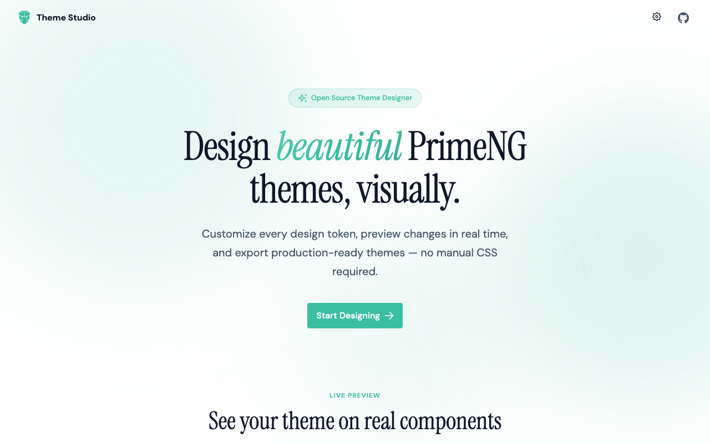
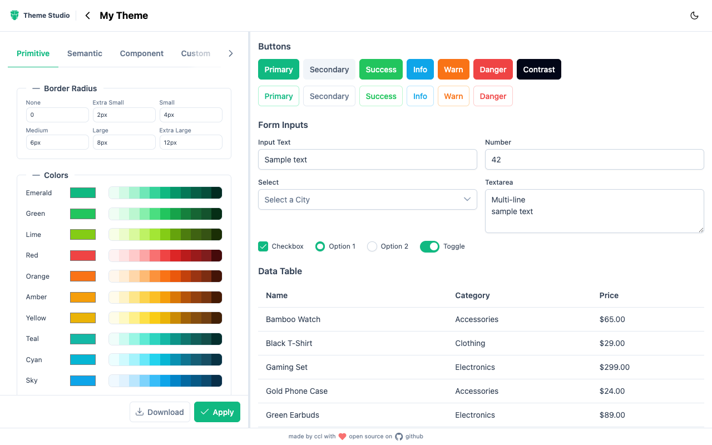

# PrimeNG Theme Studio

A visual theme designer for [PrimeNG](https://primeng.org) built with Angular 21. Customize every design token, preview changes in real time, and export production-ready themes — no manual CSS required.

**Live:** [Demo](https://prime-ng-theme-fe.vercel.app/)



## Features

- **Visual token editor** — Modify primitive colors, border radii, semantic tokens, and per-component overrides through an intuitive split-pane UI
- **Live preview** — See buttons, forms, tables, tags, and more update instantly as you tweak tokens
- **Multiple presets** — Start from Aura, Material, Lara, or Nora and make it yours
- **Dark mode** — Toggle between light and dark to preview both variants
- **Export** — Download a production-ready TypeScript preset file, or copy a base64 token to share/restore your theme later
- **Theme switcher** — Quickly change primary and surface palettes, presets, ripple, and RTL from the landing page



## Tech Stack

- **Angular 21** — Standalone components, signals, OnPush change detection
- **PrimeNG 21** — Component library and design token system
- **Tailwind CSS 4** — Utility-first styling via CSS-only config
- **Vitest** — Fast unit testing
- **@primeuix/themes** — Runtime palette and preset manipulation

## Getting Started

```bash
# Install dependencies
npm install

# Start dev server at localhost:4200
npm start

# Production build
npm run build

# Run tests
npm test
```

## Project Structure

```
src/app/
  features/
    landing/          # Landing page with hero, component preview, theme switcher
    designer/         # Theme designer with split-pane editor + live preview
      components/     # Editor tabs (primitive, semantic, component, settings, custom)
      services/       # ThemeDesignerService — central state and export logic
    blocks/           # UI block showcase (WIP, routes deactivated)
```

## How It Works

1. **Create a theme** — Pick a name and base preset (Aura, Material, Lara, or Nora)
2. **Edit tokens** — Use the tabbed editor to adjust primitive colors, border radii, semantic mappings, component-level overrides, or add custom tokens
3. **Preview live** — The right panel renders real PrimeNG components with your current theme applied
4. **Export** — Download a `.ts` preset file ready to drop into `providePrimeNG({ theme: { preset: yourTheme } })`, or copy the base64 token to restore later

## License

Open source. Made by [ccl](https://github.com/ccl) with love.
